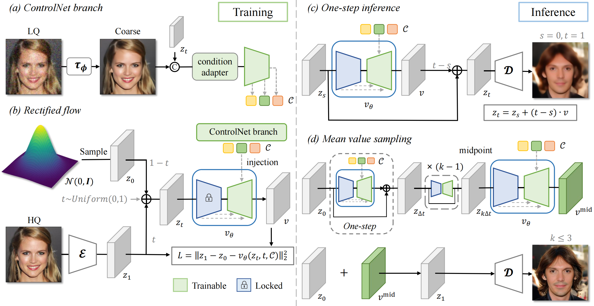

# FlowIE: Efficient Image Enhancement via Rectified Flow (CVPR 2024)

> [Yixuan Zhu](https://eternalevan.github.io/)\*, [Wenliang Zhao](https://wl-zhao.github.io/)\* $\dagger$, [Ao Li](https://rammusleo.github.io/), [Yansong Tang](https://andytang15.github.io/), [Jie Zhou](https://scholar.google.com/citations?user=6a79aPwAAAAJ&hl=en&authuser=1), [Jiwen Lu](http://ivg.au.tsinghua.edu.cn/Jiwen_Lu/) $\ddagger$
> 
> \* Equal contribution &nbsp; $\dagger$ Project leader &nbsp; $\ddagger$ Corresponding author

The repository contains the official implementation for the paper "FlowIE: Efficient Image Enhancement via Rectified Flow" (CVPR 2024).

FlowIE is a simple yet highly effective <ins>**Flow**</ins>-based <ins>**I**</ins>mage <ins>**E**</ins>nhancement framework that estimates straight-line paths from an elementary distribution to high-quality images.
## 📋 To-Do List

* [ ] Release model and inference code.
* [ ] Release code for training dataloader .


## 💡 Pipeline



## ⭐️ Performance
Coming soon!


## 😀Quick Start
### ⚙️ 1. Installation

We recommend you to use an [Anaconda](https://www.anaconda.com/) virtual environment. If you have installed Anaconda, run the following commands to create and activate a virtual environment.
``` bash
conda env create -f requirements.txt
conda activate FlowIE
```

### 💾 2. Data Preparation

We prepare the data in a samilar way as [GFPGAN](https://xinntao.github.io/projects/gfpgan) & [DiffBIR](https://github.com/XPixelGroup/DiffBIR). We list the datasets for BFR and BSR as follows:

For BFR evaluation, please refer to [here](https://xinntao.github.io/projects/gfpgan) for *BFR-test datasets*, which include *CelebA-Test*, *CelebChild-Test* and *LFW-Test*. The *WIDER-Test* can be found in [here](https://drive.google.com/file/d/1g05U86QGqnlN_v9SRRKDTU8033yvQNEa/view). For BFR training, please download the [FFHQ dataset](https://github.com/NVlabs/ffhq-dataset).

For BSR, we utilize [ImageNet](https://www.image-net.org/index.php) for training. For evaluation, you can refer to [BSRGAN](https://github.com/cszn/BSRGAN/tree/main/testsets) for *RealSRSet*. 

To prepare the training list, you need to simply run the script:
```bash
python ./scripts/make_file_list.py --img_folder /data/ILSVRC2012  --save_folder ./dataset/list/imagenet
python ./scripts/make_file_list.py --img_folder /data/FFHQ  --save_folder ./dataset/list/ffhq
``` 
The file list looks like this:
```bash
/path/to/image_1.png
/path/to/image_2.png
/path/to/image_3.png
...
``` 
### 🗂️ 3. Download Checkpoints

Please download our pretrained checkpoints from [this link](https://cloud.tsinghua.edu.cn/d/4fa2a0880a9243999561/) and put them under `./weights`. The file directory should be:

```
|-- checkpoints
|--|-- FlowIE_bfr_v1.ckpt
|--|-- FlowIE_bsr_v1.ckpt
```

### 📊 4. Test & Evaluation

You can test FlowIE with following commands:
- **Evaluation for BFR**
```bash
python inference_bfr.py --ckpt ./weights/FlowIE_bfr_v1.ckpt --has_aligned  --input /data/celeba_512_validation_lq/  --output ./outputs/bfr_exp
```

- **Evaluation for BSR**
```bash
coming soon
```
<!--```bash
CUDA_VISIBLE_DEVICES=0 \
torchrun \
--master_port 29591 \
--nproc_per_node 1 \
eval.py \
--cfg ./configs/main_train.yml \
--exp_id="main_train" \
--distributed \
```-->

The evaluation process can be done with one Nvidia GeForce RTX 3090 GPU (24GB VRAM). You can use more GPUs by specifying the GPU ids.

### 🔥 5. Training
The key component in FlowIE is a path estimator tuned from [Stable Diffusion v2.1 base](https://huggingface.co/stabilityai/stable-diffusion-2-1-base). Please download it to `./weights`. Another part is the initial module, which can be found in [checkpoints](https://cloud.tsinghua.edu.cn/d/4fa2a0880a9243999561/).

Before training, you also need to configure training-related information in `./configs/train_cldm.yaml`.
<!--**For evaluation only, you can just prepare 3DPW dataset.**-->
<!--


```
|-- common
|   |-- utils
|   |   |-- human_model_files
|   |   |-- smplpytorch
|-- data 
|   |-- J_regressor_extra.npy 
|   |-- 3DPW
|   |   |-- 3DPW_latest_test.json
|   |   |-- 3DPW_oc.json
|   |   |-- 3DPW_pc.json
|   |   |-- 3DPW_validation_crowd_hhrnet_result.json
|   |   |-- imageFiles
|   |   |-- sequenceFiles
```
## 🫰 Acknowledgments

We would like to express our sincere thanks to the author of [JOTR](https://github.com/xljh0520/JOTR) for the clear code base and quick response to our issues. 

We also thank [ControlNet](https://github.com/lllyasviel/ControlNet), [VPD](https://github.com/wl-zhao/VPD) and [LoRA](https://github.com/cloneofsimo/lora), for our code is partially borrowing from them.
-->
## 🔖 Citation

## 🔑 License

This code is distributed under an [MIT LICENSE](./LICENSE).
